# High-Level Architecture

## Early Prediction of Data Skew in Cloud-Based Big Data Jobs Using Lightweight Machine Learning Models

---

## 1. System Overview

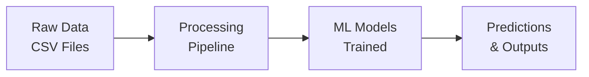

---

## 2. High-Level Architecture Diagram

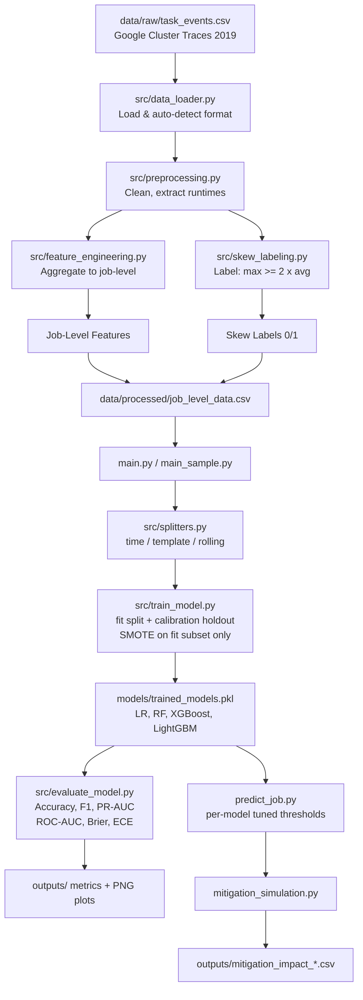

---

## 3. Component Architecture

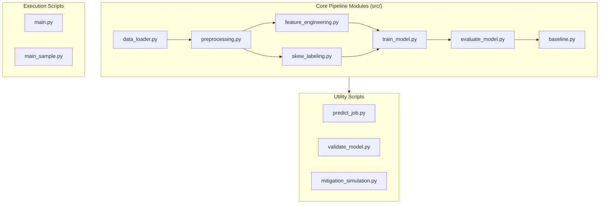

---

## 4. Data Flow Architecture

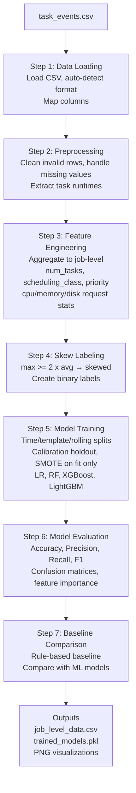

---

## 5. ML Pipeline Architecture

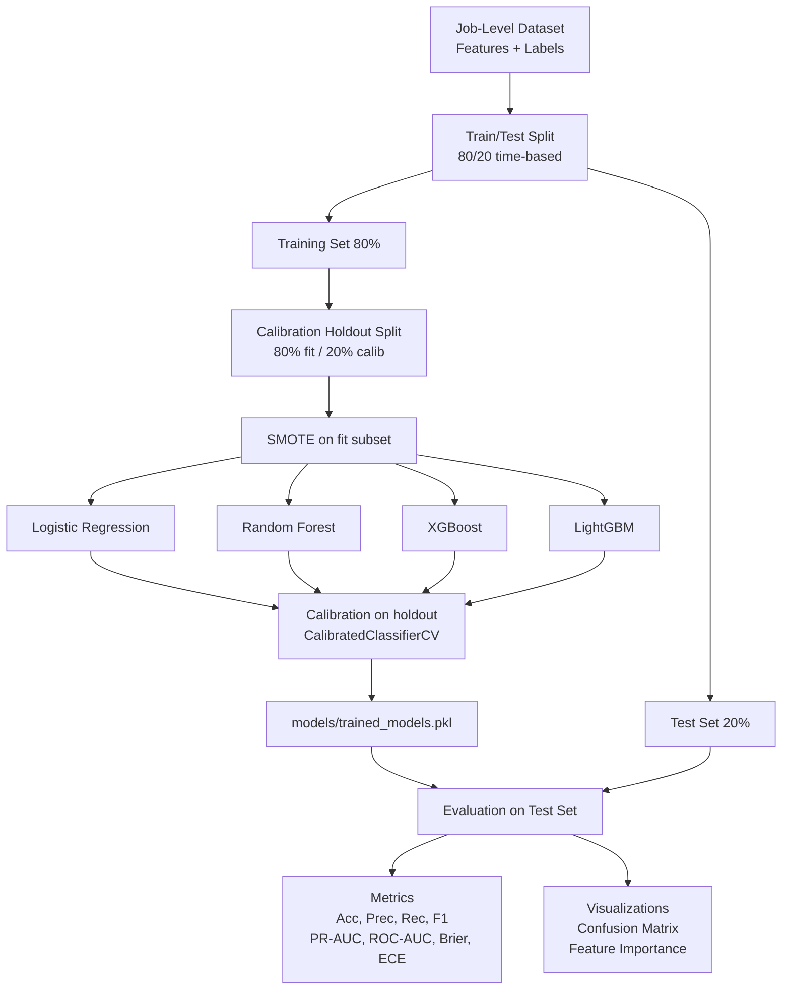

---

## 6. Technology Stack

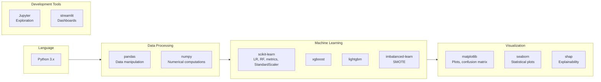

---

## 7. Deployment Architecture

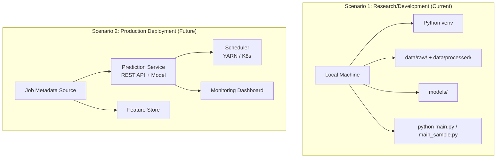

---

## 8. Key Design Decisions

### 8.1 Modular Architecture
- **Decision**: Separate modules for each pipeline stage
- **Rationale**: 
  - Easy to test individual components
  - Reusable code
  - Clear separation of concerns

### 8.2 Pre-Execution Features Only
- **Decision**: Use only features computable before job execution
- **Rationale**: 
  - Enables early prediction
  - Practical for real-world deployment
  - No need to wait for job completion

### 8.3 Lightweight ML Models
- **Decision**: Logistic Regression + Random Forest (no deep learning)
- **Rationale**:
  - Fast training and inference
  - Interpretable results
  - Low computational requirements
  - Suitable for research reproducibility

### 8.4 Auto-Detection of Data Format
- **Decision**: Automatically detect CSV format (event-based vs direct)
- **Rationale**:
  - Handles different dataset versions
  - Robust to format variations
  - User-friendly (no manual configuration)

### 8.5 Model Persistence
- **Decision**: Save models as pickle files
- **Rationale**:
  - Easy to load and use
  - Preserves scalers and models together
  - Standard Python practice

---

## 9. Scalability Considerations

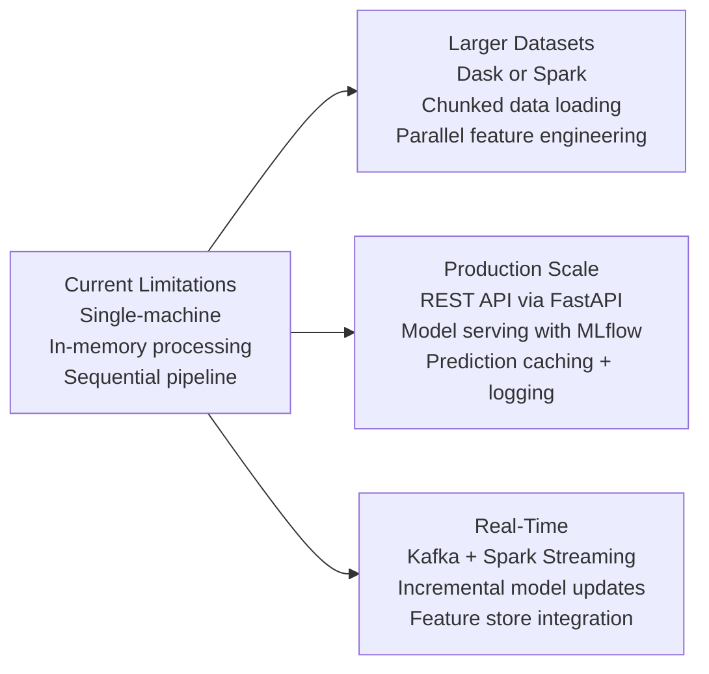

---

## 10. Security & Best Practices

**Implemented:**
- Input validation in preprocessing
- Error handling in all modules
- Type checking and conversion
- Safe file operations (path handling)

**For Production:**
- API authentication/authorization
- Input sanitization
- Rate limiting
- Model versioning
- Secure model storage
- Audit logging

---

## 11. Component Interaction Diagram

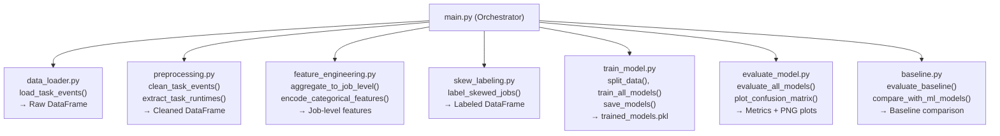

---

## 12. Data Schema

**RAW DATA (task_events.csv):**

| Column | Type | Description |
|---|---|---|
| collection_id | int/str | Job identifier |
| instance_index | int/str | Task identifier |
| start_time | int | Start time (microseconds) |
| end_time | int | End time (microseconds) |
| scheduling_class | int | Scheduling class (0-3) |
| priority | int | Priority (0-450) |

**PROCESSED DATA (job_level_data.csv):**

| Column | Type | Description |
|---|---|---|
| job_id | int | Job identifier |
| num_tasks | int | Number of tasks |
| avg_task_runtime | float | Average task runtime |
| max_task_runtime | float | Maximum task runtime |
| std_task_runtime | float | Runtime standard deviation |
| scheduling_class | int | Scheduling class |
| priority | float | Average priority |
| is_skewed | int (0/1) | Skew label |

---

## 13. Model Architecture Details

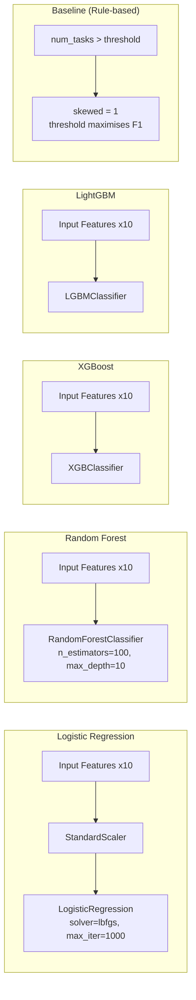

---

## 14. File Structure with Dependencies

```
project_root/
│
├── data/
│   ├── raw/                        # Input data (ignored by git)
│   └── processed/                  # Engineered job-level data
│
├── src/                            # Core pipeline modules
│   ├── data_loader.py              # ← imported by main.py
│   ├── preprocessing.py            # ← imported by main.py
│   ├── feature_engineering.py      # ← imported by main.py
│   ├── skew_labeling.py            # ← imported by main.py
│   ├── splitters.py                # ← imported by main.py
│   ├── train_model.py              # ← imported by main.py
│   ├── evaluate_model.py           # ← imported by main.py
│   └── baseline.py                 # ← imported by main.py
│
├── models/
│   └── trained_models.pkl          # ← saved by train_model.py
│
├── outputs/                        # Metrics, plots, CSVs
│
├── notebooks/
│   └── exploration.ipynb
│
├── main.py                         # Full pipeline entry point
├── main_sample.py                  # Sampled pipeline + rolling eval
├── predict_job.py                  # Single & batch inference
├── mitigation_simulation.py        # Policy impact simulation
├── validate_model.py               # Model validation utilities
└── requirements.txt
```

---

## 15. Execution Flow

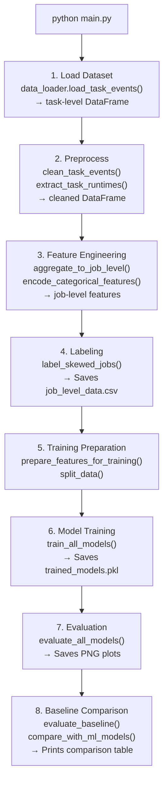

---

## Summary

This architecture provides:

✅ **Modular Design**: Each component has a single responsibility  
✅ **Scalable Pipeline**: Easy to extend with new models or features  
✅ **Reproducible**: Fixed random seeds, clear data flow  
✅ **Production-Ready**: Model persistence, prediction interface  
✅ **Research-Friendly**: Well-documented, easy to understand  
✅ **Flexible**: Handles different data formats, optional components  

The architecture follows ML best practices and is designed for both research reproducibility and potential production deployment.
