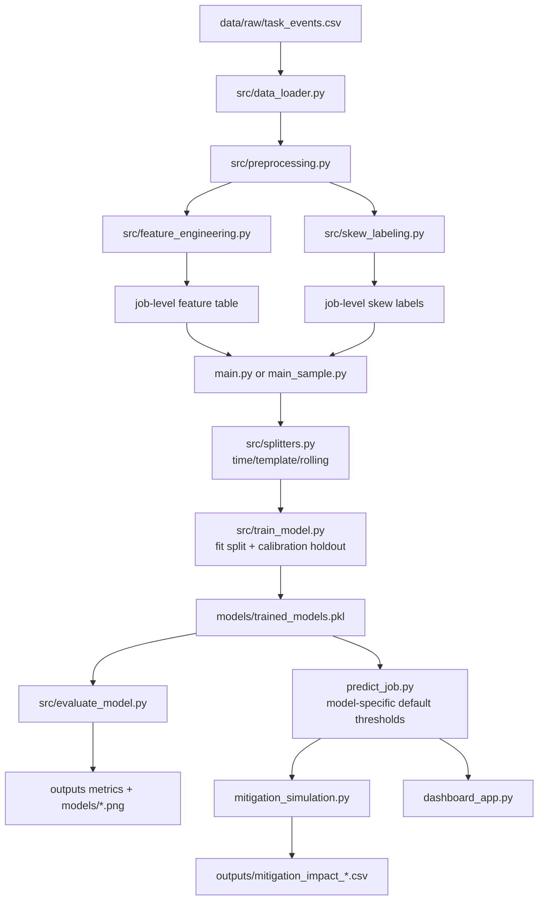

# Architecture Summary - Quick Reference

Use the --save-log flag with executable scripts to persist console output in outputs/. See [LOGGING_GUIDE.md](LOGGING_GUIDE.md).

## Current System (One Page)

## Canonical Lifecycle

1. Load raw task events from data/raw/task_events.csv.
2. Clean and normalize schemas in src/preprocessing.py.
3. Build leakage-safe pre-exec job features in src/feature_engineering.py.
4. Label skew from runtime stats in src/skew_labeling.py.
5. Split data with time-based, template-based, and rolling-time options in src/splitters.py.
6. Train LR, RF, XGBoost, LightGBM in src/train_model.py.
7. Calibrate probabilities on untouched calibration holdout (SMOTE only on fit subset) in src/train_model.py.
8. Save model bundle to models/trained_models.pkl.
9. Evaluate with Accuracy, Precision, Recall, F1, PR-AUC, ROC-AUC, Brier, ECE in src/evaluate_model.py.
10. Apply tuned per-model inference thresholds in predict_job.py.
11. Simulate policy impact in mitigation_simulation.py.

## Main Entry Points

1. main_sample.py: fastest full pipeline with rolling summary.
2. main.py: full pipeline on complete available real data.
3. train_on_synthetic.py: synthetic-only training and eval.
4. early_exec_experiment.py: early-runtime feature experiments (5, 10, 20 percent windows).
5. predict_job.py: single and batch inference interface.
6. mitigation_simulation.py: single-model or all-model operational impact comparison.
7. dashboard_app.py: streamlit live simulation and monitoring UI.

## Current Models and Defaults

Models trained in src/train_model.py:

1. logistic_regression (Pipeline: StandardScaler + LogisticRegression)
2. random_forest
3. xgboost
4. lightgbm

Current default inference thresholds in predict_job.py:

1. logistic_regression: 0.10
2. random_forest: 0.08
3. xgboost: 0.07
4. lightgbm: 0.23

## Core Artifacts

1. data/processed/job_level_data.csv: engineered job-level dataset with labels.
2. models/trained_models.pkl: calibrated model bundle.
3. outputs/threshold_optimization_hybrid_on_real_post_calibration.csv: post-calibration threshold table.
4. outputs/mitigation_impact_post_calibration_defaults.csv: mitigation outcomes under current defaults.
5. outputs/main_sample_*.log: reproducible run logs.
